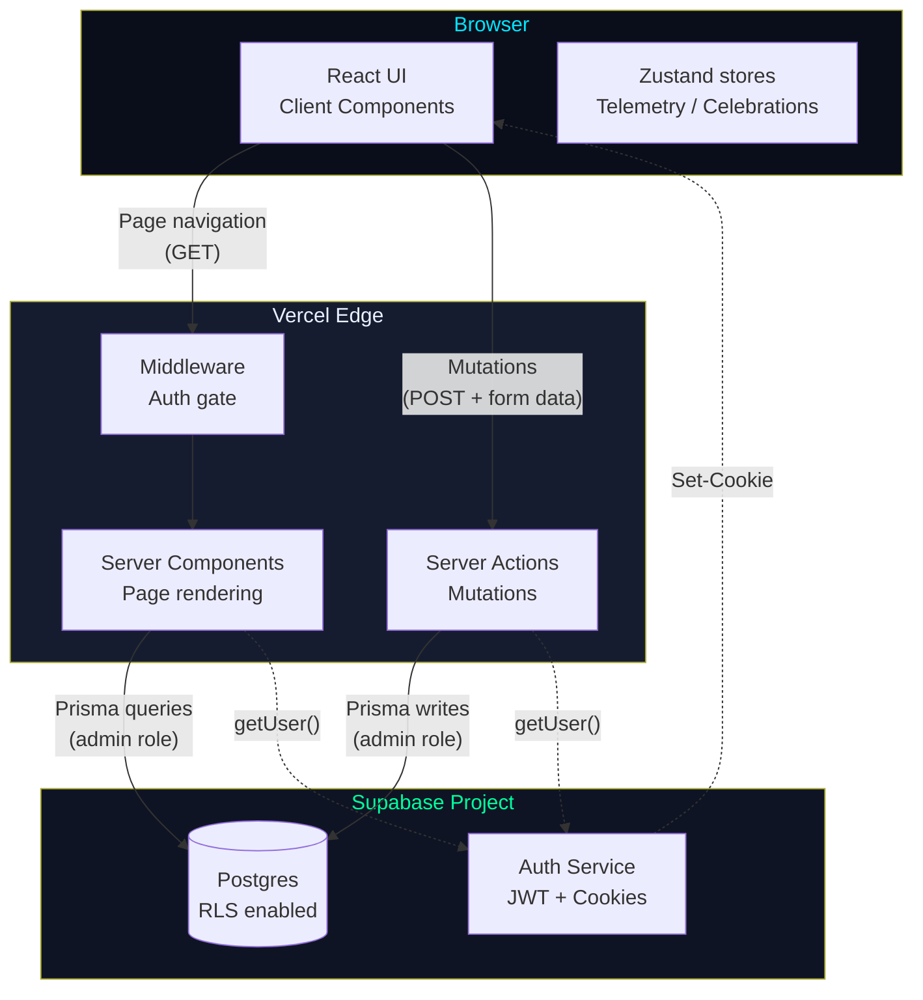
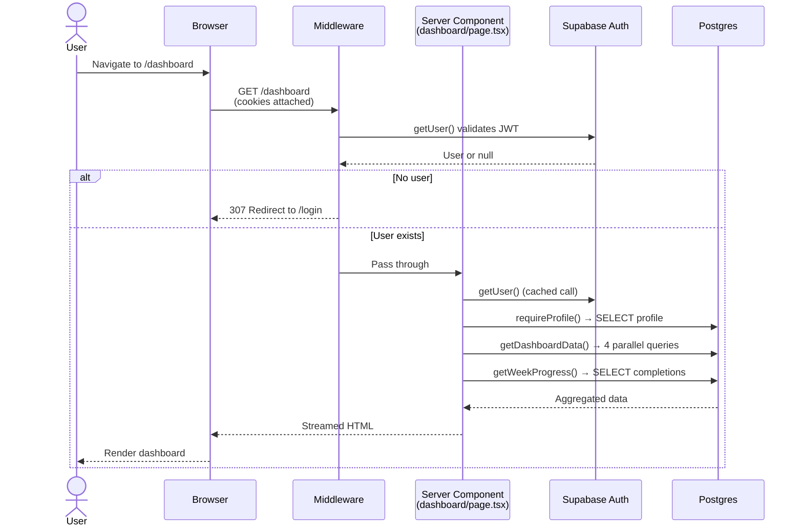
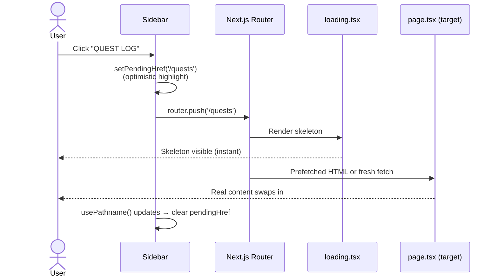
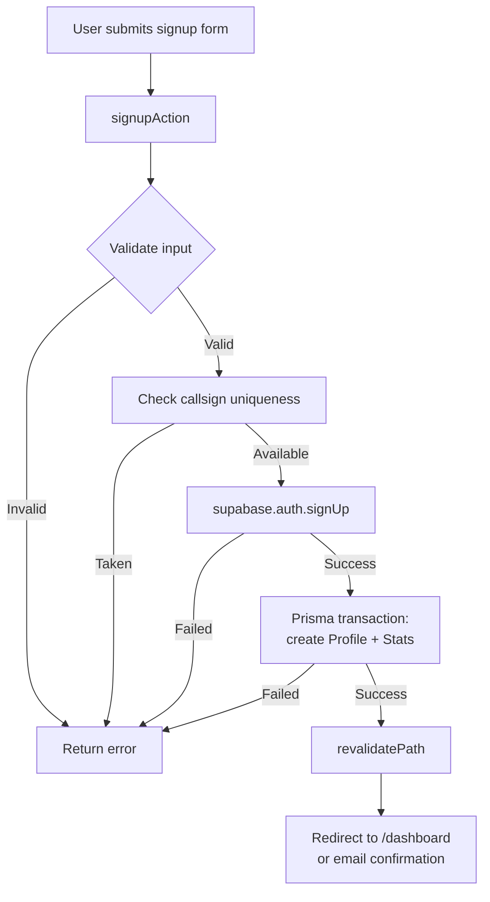
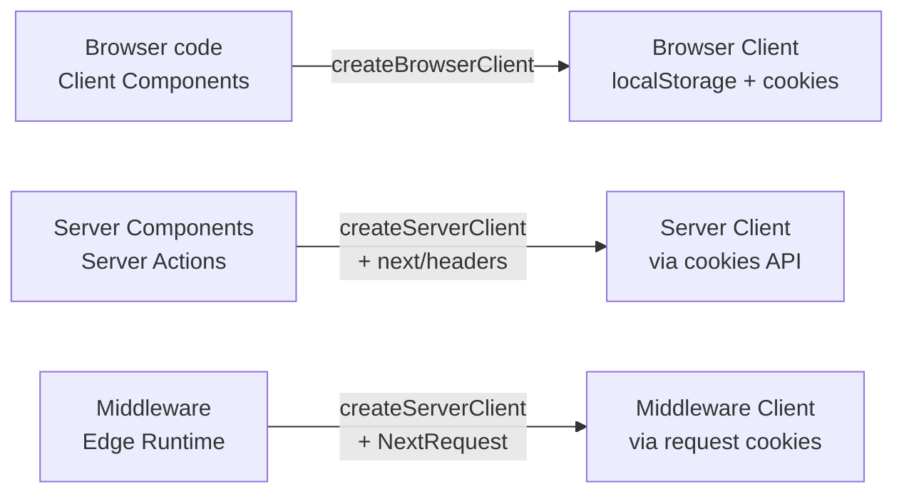
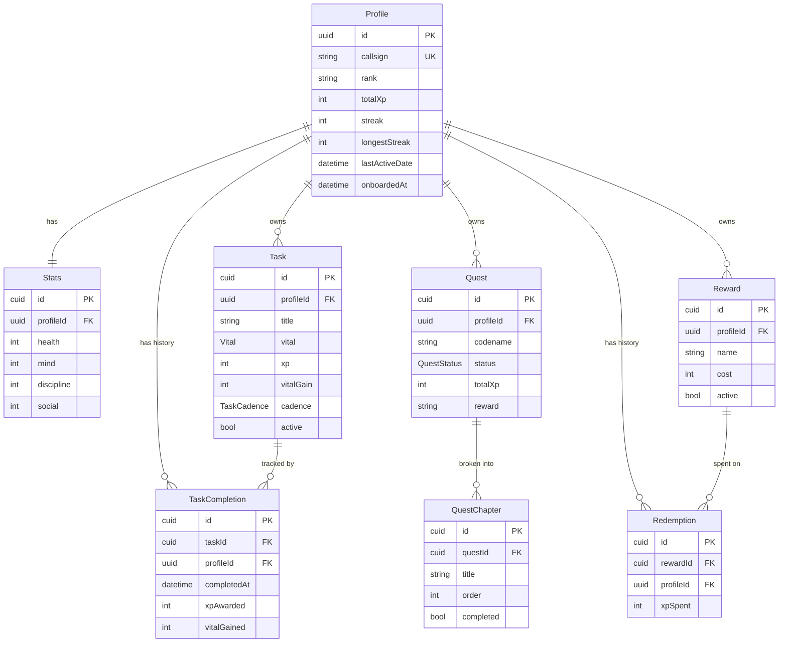
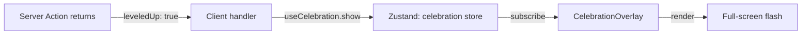
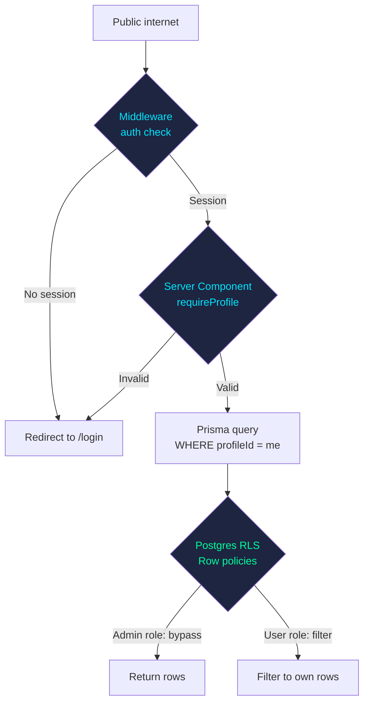

# Architecture

This document describes the technical architecture of NIGHT//OS: how the system is structured, how data flows through it, and why the major components fit together the way they do.

For *why* specific decisions were made, see [DECISIONS.md](./DECISIONS.md). For setup and usage, see [README.md](./README.md).

---

## Table of contents

1. [System overview](#system-overview)
2. [Request lifecycle](#request-lifecycle)
3. [Authentication flow](#authentication-flow)
4. [Data layer](#data-layer)
5. [Component architecture](#component-architecture)
6. [State management](#state-management)
7. [Server Actions](#server-actions)
8. [Security model](#security-model)
9. [Animation and feedback layer](#animation-and-feedback-layer)
10. [Performance considerations](#performance-considerations)

---

## System overview

NIGHT//OS is a three-tier application: browser, server, database. Unusually for a modern React app, there is no API layer. The server (Next.js) and the database (Postgres) communicate directly via Prisma. The browser only talks to the server.



### Why this shape

Most React tutorials show a "client makes fetch() calls to /api/* endpoints which write to a database." That's three serialization boundaries (component state to JSON to SQL to JSON to component state) and three places where types can drift.

This architecture has one boundary: Prisma queries return typed objects directly to Server Components, which render HTML. TypeScript types flow from the database schema through to the rendered output. Type drift is impossible by construction.

Trade-off: every interactive piece of UI needs either a Server Action call (round-trip) or local optimistic state. We chose this trade-off because read-heavy productivity apps benefit far more from type safety and SEO-able server rendering than from instant client-side updates.

---

## Request lifecycle

Three kinds of request, each with a different lifecycle.

### 1. Initial page load (GET /dashboard)



Notes:

- **Middleware runs first** on every request. It calls `supabase.auth.getUser()` which validates the JWT in the session cookie against Supabase's auth service. If invalid or missing, it redirects to `/login` before any page code runs.
- **`requireProfile()` is the gatekeeper.** Every authenticated Server Component calls it as the first thing. It re-runs the auth check (cached by Next.js for the request) and loads the user's profile from Postgres.
- **Queries run in parallel.** The dashboard needs four pieces of data (active tasks, today's completions, week's completions, active quests). These are `Promise.all`'d to minimize total latency.
- **HTML streams.** The Server Component renders to a stream, not a single blob. Skeleton states render first (via `loading.tsx`), then real content as queries resolve.

### 2. Mutation (clicking "Complete directive")

```mermaid
sequenceDiagram
    actor User
    participant UI as TaskRow<br/>(Client Component)
    participant Opt as useOptimistic
    participant SA as completeTaskAction
    participant DB as Postgres
    participant Cache as Next.js<br/>Cache

    User->>UI: Click task
    UI->>Opt: Apply optimistic toggle
    UI-->>User: Checkbox flips instantly
    UI->>UI: spawnXpAt() floating +XP
    UI->>SA: completeTaskAction(taskId)
    SA->>DB: Verify ownership
    SA->>DB: BEGIN transaction
    SA->>DB: INSERT TaskCompletion
    SA->>DB: UPDATE Profile (xp, streak)
    SA->>DB: UPDATE Stats (vital)
    SA->>DB: COMMIT
    SA->>Cache: revalidatePath('/dashboard')
    SA-->>UI: { success, xpAwarded, leveledUp, ... }
    UI->>UI: log() telemetry strip
    alt Leveled up
        UI->>UI: showCelebration()
    end
    Cache-->>UI: Re-render with fresh data
```

Notes:

- **Optimistic UI fires before the network call.** React 19's `useOptimistic` lets us update the UI state immediately and roll back if the server returns an error.
- **The mutation is a single transaction.** Four writes (completion, profile XP/streak, stats, optional quest status) happen atomically. Either all succeed or none do.
- **`revalidatePath` invalidates cached queries.** Next.js re-fetches the page data, but only after the action completes. The optimistic update bridges the gap.
- **The return value drives UX.** The action returns rich data (`leveledUp`, `streakMilestone`, `xpAwarded`) so the client can decide whether to show a celebration overlay.

### 3. Navigation (clicking a sidebar link)



The optimistic nav highlight combined with `loading.tsx` skeletons means navigation *feels* instant even when the server takes 300ms to respond. The user sees the new section's outline immediately, with shimmer animations indicating loading.

---

## Authentication flow

Authentication uses Supabase Auth with email/password. The session is stored as a JWT in an httpOnly cookie, set by Supabase and read by every server-side call.

### Signup flow



Key points:

- **Callsign uniqueness is checked BEFORE creating the auth user.** If we created the auth user first and then found the callsign taken, we'd have an orphaned auth record with no profile.
- **Profile + Stats creation is a single transaction.** Either both exist or neither does. This ensures `requireProfile()` never finds a profile without stats.
- **No starter content.** Past versions auto-created sample tasks and rewards. This was removed because users want their slate clean from day one.

### Three Supabase clients, three contexts

The Supabase SSR library requires three different client instances depending on where it runs:



These are in:

- `src/lib/supabase/client.ts` (browser client)
- `src/lib/supabase/server.ts` (server client, uses `next/headers`'s `cookies()`)
- `src/lib/supabase/middleware.ts` (middleware client, uses `NextRequest.cookies`)

They share the same env vars and connect to the same Supabase project. The difference is purely how they read and write cookies for the session.

---

## Data layer

### Schema overview



### Key modeling decisions

**Profile.id is the Supabase auth UUID.** No separate user table. The Postgres `profiles` table extends Supabase's managed `auth.users` table 1:1, using the same primary key. This avoids a join on every query.

**TaskCompletion is an event log, not a flag.** A task isn't "complete today" because of a `completedToday` boolean. It's complete because there's a row in `task_completions` dated today. This:

- Naturally handles daily reset (rows from yesterday don't count)
- Provides a complete history for analytics (weekly XP charts, longest streak)
- Means streak calculation is a simple query, not derived state

**Stats is a separate table from Profile.** Profile has identity-like fields (callsign, rank). Stats has the four vital integers. Separating them keeps Profile small for frequent reads and leaves room for future stat history (e.g., stat snapshots per week).

**Profile.totalXp is denormalized.** It could be computed by `SUM(xpAwarded) FROM task_completions + SUM(xp_from_quests) - SUM(xpSpent FROM redemptions)`. We chose to materialize it on Profile because it's read on every dashboard load and updated rarely. Trade-off accepted: if XP totals ever desync from the event log, we'd need to recompute.

### Querying

All queries live in `src/lib/db/queries.ts`. They're organized by page (e.g., `getDashboardData()`) rather than by model. Each function returns exactly what its caller needs, pre-aggregated.

Example: `getDashboardData()` runs four parallel queries:

```typescript
const [activeTasks, completionsToday, weeklyCompletions, activeQuests] =
  await Promise.all([
    prisma.task.findMany({ where: { profileId, active: true, cadence: "daily" } }),
    prisma.taskCompletion.findMany({ where: { profileId, completedAt: { gte: todayStart } } }),
    prisma.taskCompletion.findMany({ where: { profileId, completedAt: { gte: sevenDaysAgo } } }),
    prisma.quest.findMany({ where: { profileId, status: "active" }, take: 3 }),
  ]);
```

Then post-processes: pairs tasks with completions, aggregates weekly XP by day, computes quest progress percentages. Returns a flat shape ready for the React tree.

---

## Component architecture

The codebase has three component categories:

### 1. HUD primitives (`src/components/hud/`)

Pure presentational building blocks of the design system:

| Component | Purpose |
|-----------|---------|
| `HUDPanel` | Container with corner brackets, label, status indicator |
| `StatBar` | Animated horizontal stat bar per vital |
| `XPGauge` | Level badge and XP-to-next-level progress |
| `StreakDisplay` | Day count, combo multiplier, week dots |
| `GlitchText` | Text with chromatic-aberration glitch effect |
| `SystemClock` | Live clock with HUD styling |
| `QuestCard` | Quest summary card with chapter progress |
| `Skeleton` | Shimmer placeholder for loading states |
| `Modal` | Reusable dialog with HUD chrome |
| `ConfirmDialog` | Confirmation prompt for destructive actions |

These have no business logic. They take props and render. Designed to be reusable across pages.

### 2. Domain panels (`src/components/hud/`, larger files)

Stateful client components that own a section of a page:

| Component | Owns |
|-----------|------|
| `DirectivesPanel` | Daily directives list with CRUD, optimistic UI |
| `QuestPanel` | Quest list, expansion, chapter completion |
| `RewardsPanel` | Rewards list, redemption flow |
| `TelemetryStrip` | Bottom-of-screen action log |
| `FloatingXpLayer` | Damage-number-style XP indicators |
| `CelebrationOverlay` | Full-screen flashes for level-ups, etc. |
| `OnboardingTour` | First-login walkthrough |

These call Server Actions, manage optimistic state, trigger animations.

### 3. Forms (`src/components/forms/`)

Modal forms for create and edit:

- `TaskForm` handles both create and edit modes via optional `initial` prop
- `QuestForm` follows the same pattern, with a dynamic chapter list editor
- `RewardForm` follows the same pattern

All three follow the same shape:

```tsx
<Modal open={open} onClose={onClose} title={...}>
  <form action={handleSubmit}>
    {/* fields */}
    <FormButtons onCancel={onClose} submitLabel={...} />
  </form>
</Modal>
```

The form's `action` attribute receives the function that calls either `createXxxAction` or `updateXxxAction` based on whether `initial` was passed.

### Layout

Two layouts wrap pages:

- **Root layout** (`src/app/layout.tsx`) loads fonts, mounts global animation layers (TelemetryStrip, FloatingXpLayer, CelebrationOverlay), sets up the ambient background.
- **App layout** (`src/app/(app)/layout.tsx`) wraps all authenticated pages with the sidebar and top bar.

The `(app)` is a [route group](https://nextjs.org/docs/app/building-your-application/routing/route-groups). It groups routes for layout sharing without affecting URLs. `/dashboard` lives at `src/app/(app)/dashboard/page.tsx` and the parentheses don't appear in the URL.

---

## State management

State lives in three places, used for three different things:

### 1. Server state (the source of truth)

Lives in Postgres. Read via Server Components, written via Server Actions. The client never holds canonical state. When you complete a task, the new XP total lives in the database; the page is invalidated and re-renders.

### 2. Optimistic state (transient UI hints)

React 19's `useOptimistic` hook holds short-lived predictions of what the server state *will* be. Used in `DirectivesPanel` to flip checkboxes instantly. Reverts automatically when the server's actual response comes back (which may agree or disagree with the optimistic guess).

### 3. Ephemeral UI state (Zustand stores)

For things that aren't persisted but cross component boundaries:



Two stores:

- **`useTelemetry`** holds log entries for the bottom HUD strip. Any component can call `log("DIRECTIVE COMPLETE", { xp: 120 })` and the strip displays it.
- **`useCelebration`** holds a single active celebration. Components call `show({ type: "level_up", ... })` and the overlay renders.

Both auto-dismiss with timers. They live in `src/lib/stores/`.

There is no global Redux, Recoil, or Jotai. We considered React Query / SWR but rejected it (no client-side data fetching needed).

---

## Server Actions

All mutations go through Server Actions. They live in `src/actions/`, one file per domain:

- `auth.ts`: `loginAction`, `signupAction`, `logoutAction`
- `tasks.ts`: `createTaskAction`, `updateTaskAction`, `archiveTaskAction`, `completeTaskAction`, `uncompleteTaskAction`
- `quests.ts`: `createQuestAction`, `updateQuestAction`, `deleteQuestAction`, `abandonQuestAction`, `completeChapterAction`, `uncompleteChapterAction`
- `rewards.ts`: `createRewardAction`, `updateRewardAction`, `deactivateRewardAction`, `redeemRewardAction`
- `onboarding.ts`: `completeOnboardingAction`, `restartOnboardingAction`

Every action follows the same shape:

```typescript
"use server";

export async function someAction(input): Promise<Result> {
  // 1. Auth check
  const profile = await requireProfile();

  // 2. Validate input
  const validation = validateInput(input);
  if (validation.error) return { error: validation.error };

  // 3. Authorization check (does this user own the resource?)
  const resource = await prisma.x.findUnique(...);
  if (resource.profileId !== profile.id) return { error: "Not yours" };

  // 4. Mutation (transactional if multi-step)
  await prisma.$transaction(...);

  // 5. Cache invalidation
  revalidatePath("/affected-page");

  // 6. Return rich data for the client
  return { success: true, ... };
}
```

Server Actions are typed. The client knows their return type at compile time. There's no need for "API contracts" because there's no API. Just typed function calls that happen to run on the server.

---

## Security model

Multi-layered defense:



### Layer 1: Middleware

`src/middleware.ts` runs on every request. It validates the JWT in the session cookie. Unauthenticated requests to protected routes (`/dashboard`, `/quests`, etc.) get a 307 redirect to `/login`.

### Layer 2: `requireProfile()`

Inside Server Components, `requireProfile()` (in `src/lib/auth.ts`) re-validates the session and loads the user's profile. This is the single chokepoint: every protected page calls it as the first line.

### Layer 3: Application-level authorization

Every server action checks `resource.profileId === profile.id` before mutating. This prevents a logged-in user from modifying someone else's data even if they guess the ID.

### Layer 4: Row Level Security (Postgres)

RLS policies on every table enforce `auth.uid() = profileId` at the database level. Prisma uses an admin connection that bypasses RLS, so these policies don't restrict our queries. But if someone ever called Supabase's REST API directly with a user JWT (e.g., `GET /rest/v1/tasks`), RLS would only return that user's rows.

This is defense-in-depth: if a code bug somewhere lets an unscoped query slip through, RLS catches it. The cost of enabling RLS is one SQL script. The benefit is significant.

### Why not full RLS enforcement via Prisma?

We could connect Prisma as the authenticated user (passing the JWT through), making RLS the *primary* enforcement. We didn't because:

- The required Prisma extensions are non-trivial
- Performance overhead (auth context check per query)
- Our application-layer checks already work
- For a single-user-at-a-time app, gatekeeper logic is sufficient

This is documented in [DECISIONS.md](./DECISIONS.md).

---

## Animation and feedback layer

A core aesthetic decision: the UI should *feel* alive without character art. Three systems implement this:

### Ambient animations

In `globals.css`:

- **Scan line.** A horizontal line sweeps top-to-bottom every 9 seconds, fixed position, low opacity.
- **Grid pulse.** The background grid oscillates between 0.4 and 0.9 opacity over 6 seconds.
- **Idle glitch.** Elements with `.idle-glitch` flicker briefly every 45 seconds.

These respect `prefers-reduced-motion` and disable in that mode.

### Action feedback

When the user clicks a task:

1. **Optimistic state** flips the checkbox immediately
2. **`spawnXpAt()`** spawns a floating "+120 XP" indicator at the click coordinates that rises and fades
3. **`log()`** dispatches a telemetry entry, which appears in the bottom strip for 4 seconds
4. **Server Action** runs, returns
5. If `leveledUp` or `streakMilestone` is true, **`showCelebration()`** triggers a full-screen overlay

All four are independent. They could be turned off individually without affecting the others.

### Celebration overlay

Triggered for three event types (`level_up`, `quest_complete`, `streak_milestone`). Renders a full-screen overlay with:

- Radial pulse animation
- Sweeping scan line
- Glitched title
- Animated badge (the new level number, or "CLEAR")
- Auto-dismisses after 3.5s; click or Esc dismisses earlier

Implemented as a Zustand store and a globally-mounted overlay component. Any handler can call `useCelebration.getState().show({...})`.

---

## Performance considerations

### Current state

- Initial page load: ~500-800ms on a fresh dev server (mostly compile-on-demand)
- Production build: ~200-400ms per page navigation (Vercel + Mumbai-region Supabase)
- Task completion: feels instant (optimistic UI); ~250ms for actual server confirmation

### Known bottlenecks

**`revalidatePath` triggers a full page re-render.** When a task completes, all queries on the page re-run. For a dashboard with 4 parallel queries, that's ~150-300ms of database time. Could be optimized by re-fetching only the changed data, but adds complexity.

**Every page is `force-dynamic`.** No caching between requests. This is correct for personalized data (every user sees different content), but means every navigation hits the database.

**Cold starts on Vercel.** Serverless functions can have ~500ms cold starts. Hot functions are under 50ms. The first request after idle is slower.

### What we did NOT do

- **No service worker or offline support.** This is an online app.
- **No image optimization.** There are no images.
- **No code splitting beyond Next.js defaults.** App is small enough.
- **No real-time subscriptions.** Stale data is acceptable; refresh works.

### What we did do

- **Parallel queries with `Promise.all`** wherever possible
- **Optimistic UI** for the most-common action (completing tasks)
- **Loading skeletons** for every page, so navigation always feels responsive
- **Prefetching** via `<Link>` defaults; next pages start loading on hover

### Scaling considerations

This app would scale to thousands of users with the current architecture, with caveats:

- Supabase free tier supports 50K MAUs, 500MB DB. Plenty of headroom.
- Vercel Hobby supports 100GB bandwidth per month. Each page is under 100KB, so that's a million page views.
- Prisma pooler `connection_limit=5` per function instance. Vercel can spin up many instances. The pooler handles up to 200 concurrent connections. Should hold to about 10K concurrent users before tuning is needed.

To scale beyond that: paid Supabase, dedicated DB, read replicas, Redis cache layer. None of which is needed for the current intended scale (personal use).
